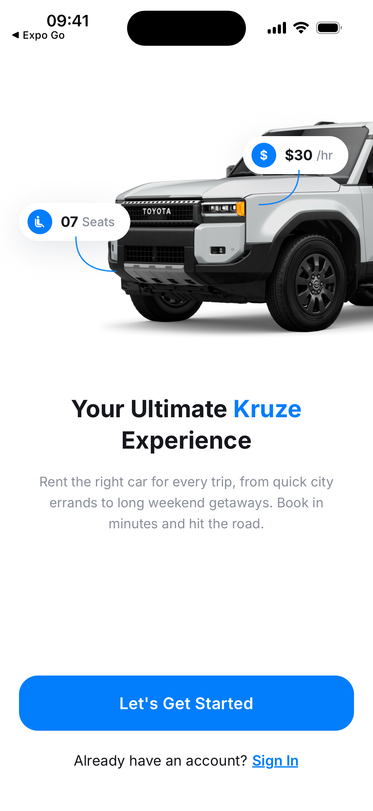
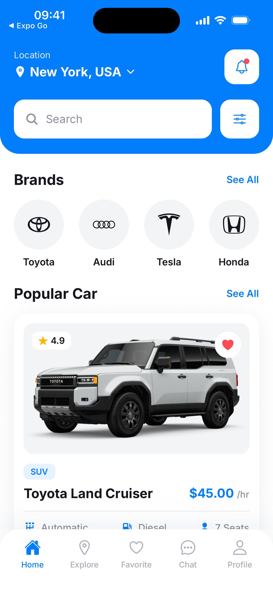
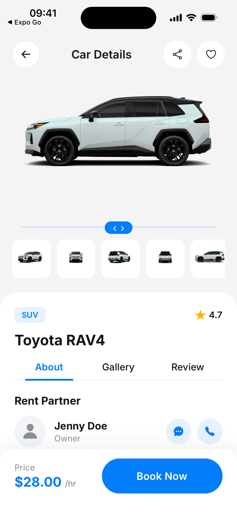
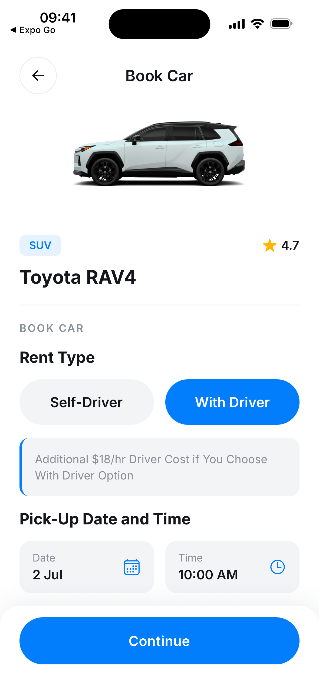
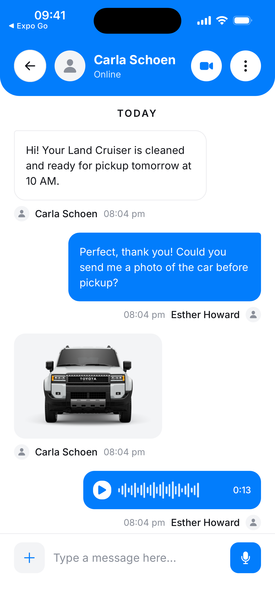
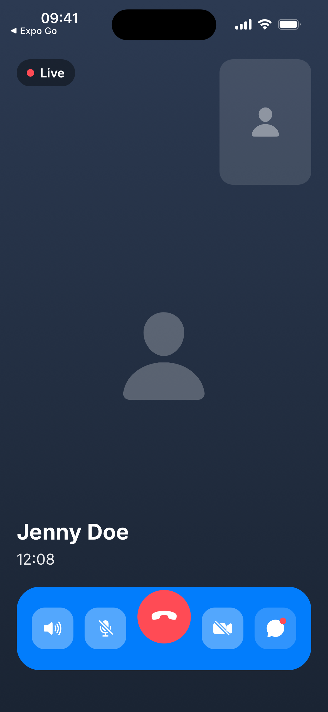
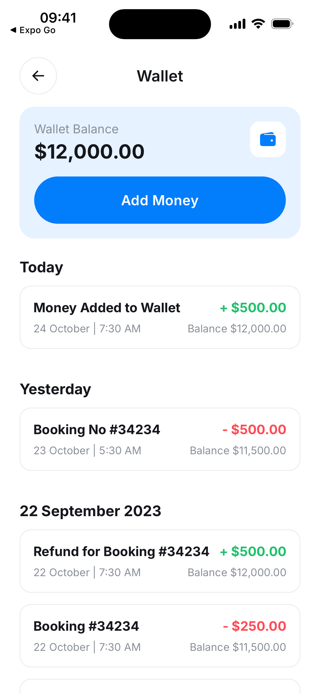
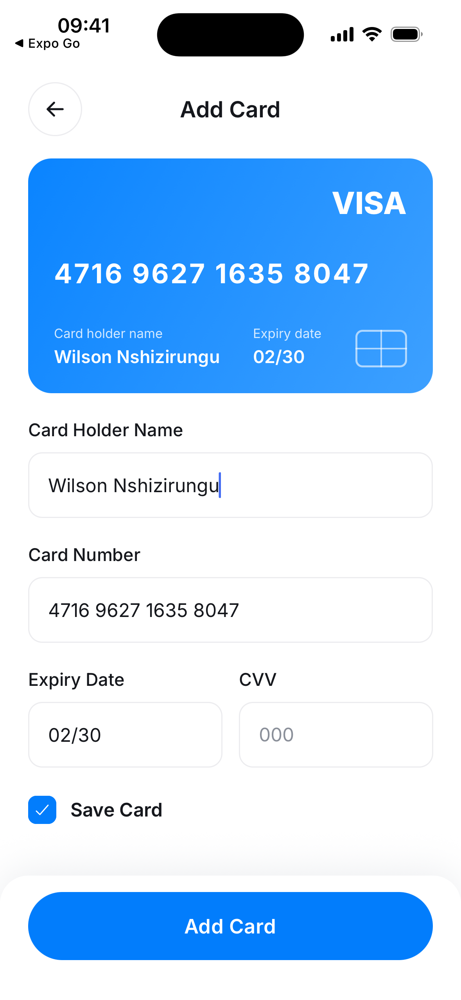

<h1 align="center">Kruze 🚗</h1>

<p align="center">
  <strong>Your ultimate car‑rental experience.</strong><br />
  Browse cars, compare specs, book with or without a driver, chat with rental partners, and pay — all from a single, beautifully crafted mobile app.
</p>

<p align="center">
  
  
  
  
  
  
</p>

---

## 📱 Screenshots

| 👋 Welcome | 🏠 Home | 🚗 Car Details | 📅 Booking |
| :--------: | :-----: | :------------: | :--------: |
|  |  |  |  |

<details>
<summary><strong>More screens</strong> — welcome, chat, wallet, payments &amp; calls</summary>

<br />

| 💬 Chat | 📞 Call | 💰 Wallet | 💳 Add Card |
| :-----: | :-----: | :-------: | :---------: |
|  |  |  |  |

</details>

---

## ✨ Overview

**Kruze** is a mobile car‑rental app built with **Expo** and **React Native**. It covers the full renter journey — from discovering a car to booking, paying, and staying in touch with the owner — wrapped in a modern, native‑feeling UI with haptics, blur/glass effects, and smooth animations.

The app ships with a curated catalog of vehicles (rendered from local data) and a complete set of screens, so the entire experience is explorable end‑to‑end without a backend.

## 🎯 Features

| Area | What's included |
| --- | --- |
| **Onboarding & Auth** | Welcome hero, onboarding walkthrough, sign‑in / sign‑up, OTP verification, password manager & reset |
| **Discover** | Location picker, search & results, brand filters (Toyota, Audi, Tesla, Honda…), advanced filter sheet, "Popular Cars" |
| **Car Details** | Multi‑angle image gallery, specs (transmission, fuel, seats), ratings & reviews, rental‑partner profile |
| **Booking** | Self‑driver or with‑driver options, pick‑up date & time, price breakdown, booking confirmation & e‑receipt |
| **Trip lifecycle** | Pickup OTP, live directions, "arrived" flow, cancel rental, leave a review |
| **Wallet & Payments** | Wallet balance, add money, transaction history, saved cards, add‑card flow, payment success |
| **Messaging** | 1:1 chat with rental partners (text, image & voice messages) and in‑app audio/video calls |
| **Profile** | Your profile, my bookings, favorites, notifications & settings, invite friends, help center, privacy policy |

## 🛠️ Tech Stack

- **[Expo](https://expo.dev) SDK 56** &nbsp;·&nbsp; **React Native 0.85** &nbsp;·&nbsp; **React 19**
- **[Expo Router](https://docs.expo.dev/router/introduction)** — file‑based routing with typed routes
- **[React Compiler](https://react.dev/learn/react-compiler)** — enabled via Expo experiments
- **[Reanimated](https://docs.swmansion.com/react-native-reanimated/) 4** + **Gesture Handler** + **Worklets** — animations & gestures
- **[@expo/ui](https://docs.expo.dev/versions/latest/sdk/ui/)**, **expo‑glass‑effect**, **expo‑blur**, **expo‑symbols**, **expo‑haptics**, **expo‑linear‑gradient** — native UI polish
- **[Inter](https://rsms.me/inter/)** via `@expo-google-fonts/inter`
- **[AsyncStorage](https://docs.expo.dev/versions/latest/sdk/async-storage/)** — local persistence for bookings, favorites & wallet
- **react‑native‑svg** — brand logos & vector icons
- **TypeScript** throughout

## 📂 Project Structure

```
kruze/
├─ src/
│  ├─ app/                 # Expo Router routes (~50 screens)
│  │  ├─ (tabs)/           # Home · Explore · Favorite · Chat · Profile
│  │  ├─ car/[id].tsx      # Car details (dynamic route)
│  │  ├─ book/[id].tsx     # Booking flow (dynamic route)
│  │  ├─ wallet.tsx, add-card.tsx, chat-thread.tsx, video-call.tsx, …
│  │  └─ _layout.tsx       # Root navigation layout
│  ├─ components/          # Reusable UI
│  │  ├─ cars/             # CarCard, SpecsRow
│  │  ├─ icons/            # KruzeLogo, BrandIcons, SocialIcons
│  │  └─ ui/               # Header, PrimaryButton, Chip, Field, RangeSlider, …
│  ├─ state/              # React Context stores (bookings, favorites, wallet)
│  ├─ data/               # cars.ts — the vehicle catalog
│  ├─ theme/              # colors, typography, layout
│  ├─ hooks/              # theme & color‑scheme hooks
│  └─ constants/          # theme constants
├─ assets/                # icons, splash, car renders & mockups
├─ screenshots/           # app screenshots (used in this README)
└─ app.json               # Expo app config
```

## 🚀 Getting Started

### Prerequisites

- **[Node.js](https://nodejs.org/)** (LTS)
- **[Xcode](https://developer.apple.com/xcode/)** (iOS) and/or **[Android Studio](https://developer.android.com/studio)** (Android)
- Expo tooling is invoked via `npx` — no global install required

### Installation

```bash
git clone <your-repo-url> kruze
cd kruze
npm install
```

### Run the app

This project uses a **development build** (via `expo-dev-client`), which enables the full native module set:

```bash
npx expo run:ios       # build & launch on the iOS Simulator
# or
npx expo run:android   # build & launch on an Android emulator/device
```

The first run compiles the native project (a few minutes); subsequent runs are incremental. After it's installed, start the dev server anytime with:

```bash
npx expo start
```

> 💡 You can also preview quickly in **[Expo Go](https://expo.dev/go)**, but native modules such as `expo-glass-effect` and `@expo/ui` only render fully in a development or release build.

## 📜 Available Scripts

| Script | Description |
| --- | --- |
| `npm start` | Start the Expo dev server |
| `npm run ios` | Start with the iOS Simulator |
| `npm run android` | Start with an Android emulator |
| `npm run web` | Run the app in the browser |
| `npm run lint` | Lint the project with ESLint |

## 🧭 Architecture Notes

- **Navigation** is fully file‑based: every file under `src/app` maps to a route, with `(tabs)` for the bottom‑tab section and `[id]` segments for dynamic car/booking routes. Typed routes are enabled for autocomplete‑safe navigation.
- **State** lives in lightweight React Context stores under `src/state` (`bookings`, `favorites`, `wallet`) and persists to disk via AsyncStorage, so your data survives app restarts.
- **Data** is sourced from `src/data/cars.ts`, keeping the UI decoupled from any specific backend and easy to wire to a real API later.
- **Design system** is centralized in `src/theme` (colors, typography, layout) and surfaced through reusable primitives in `src/components/ui`, giving every screen a consistent look built around the Kruze blue `#027DFC`.

## 📄 License

Released under the [MIT License](LICENSE).
